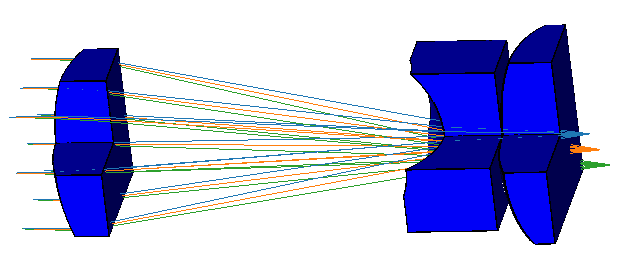
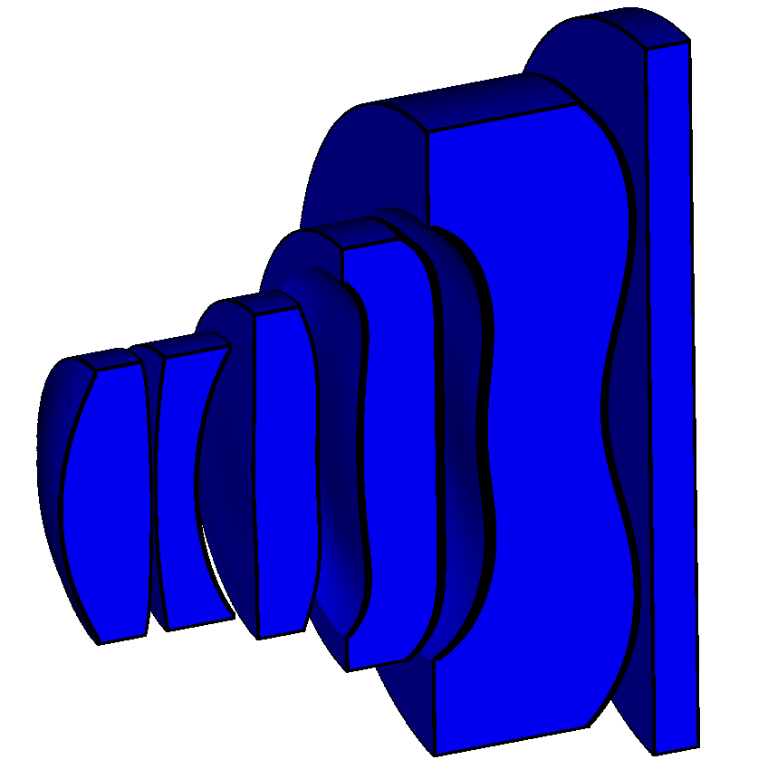
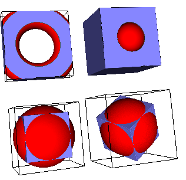

# otk - optics toolkit

Toolkit for doing optics in Python

Features include

* 3D engine based on [sphere tracing](https://link.springer.com/article/10.1007/s003710050084) for simple robust implicit surfaces and constructive solid geometry,
* nonsequential ray tracing engine,
* programmatic lookup of full [RefractiveIndex.INFO](https://refractiveindex.info/) database,
* import of lenses and glass catalogs from Zemax.

## Installation

Installation methods include:

* Clone repository and interact with it using [Poetry](https://python-poetry.org/) e.g. `poetry run view-zmx <zemax-file>` or `poetry shell`.
* Install from package repository (e.g. PyPi) with pip: `pip install otk`.
* Development mode with [: `poetry add <path-to-local-repo>`.
* From package repository (e.g. PyPi) with Poetry: `poetry add otk`.

## Getting started

1. Check out the scripts in [examples](./examples).
2. View one of the lenses in [designs](./designs) with the command line tool `view-zmx`.

## Documentation

(Yep, this is it at the moment.)

### Command line tools

`view-zmx <zemaxfile>` launches a viewer of a Zemax lens.

### Packages

* `otk.sdb` - Geometry library based on signed distance bounds.
* `otk.rt1` - First attempt at ray tracing package. Superseded by otk.rt2.
* `otk.rt2` - Ray tracing package with flexible geometry based on otk.sdb. See also `otk.rt2_scalar_qt`.
* `otk.asbp` - Angular spectrum beam propagation.
* `otk.abcd` - 1D ray transfer matrix ("ABCD matrices") tools.
* `otk.rtm4` - abstractions for 1D ray transfer matrices, building upon `otk.abcd`.
* `otk.pgb` - parabasal Gaussian routines for doing wave optical calculations with ray tracing results. Builds upon `otk.rt1`.
* `otk.h4t` - homogeneous 4x4 transformation matrices.
* `otk.paraxial` - basic paraxial optics calculations.
* `otk.math` - various optics-specific math functions.
* `otk.pov` - tools for generating POV-Ray scenes of optical setups.
* `otk.pov` - for calculating properties of prisms.
* `otk.qt` - Qt-related utilities
* `otk.ri` - refractive index tools.
* `otk.trains` - axially symmetric optical systems
* `otk.v3` - operations on homogeneous vectors in 2D
* `otk.v4` - operations on homogeneous vectors in 3D
* `otk.v4b` - broadcasting operations on homogeneous vectors in 3D
* `otk.zemax` - reading Zemax files

## Roadmap

* Import of wavelengths, field, and stop from Zemax.
* Variables to allow rapid changes for animation and optimization.
* Cool demos: rainbow, lighthouse.
* Improve physical & wave optics.
  * Upgrade parabasal Gaussians to use rt2.
  * Upgrade asbp to use rt2.
  * Demos e.g. spherical aberration acting on Gaussian beam, Arago spot.

## Folder contents

* `otk` - the Python package itself. Package data includes
  * `otk/properties` - material properties databases.
  * `otk/notes` - miscellaneous notes including derivations.
* `examples` - example scripts.

## Package management

otk uses [Poetry](https://python-poetry.org/) for package management. This means that dependencies, version, entry points etc are all defined in [`pyproject.toml`](./pyproject.toml).

### Using [PyPi test instance](https://test.pypi.org/)

To setup, add test.pypi.org to your Poetry configuration with `poetry config repositories.test https://test.pypi.org/legacy/`. Note the [trailing slash](https://github.com/python-poetry/poetry/issues/742).

To publish (after `poetry build`), `poetry publish -r test`.

To test that it installs properly,
1. create and activate a virtual environment, and
2. per [instructions](https://packaging.python.org/guides/using-testpypi/), `pip install --index-url https://test.pypi.org/simple/ --extra-index-url https://pypi.org/simple otk`.

However, I was unable to re-upload the same version (i.e. to correct a mistake) to test.pypi.org (even after logging in to the website and deleting the release).

## Testing

Test framework is [pytest](https://docs.pytest.org/en/latest/) and [tox](https://tox.readthedocs.io/en/latest/).

## Contributing

Please do.
